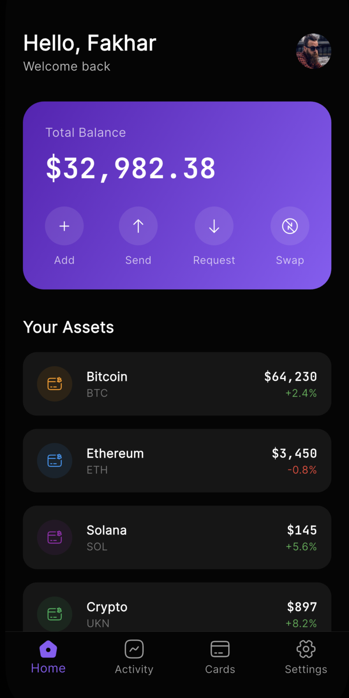
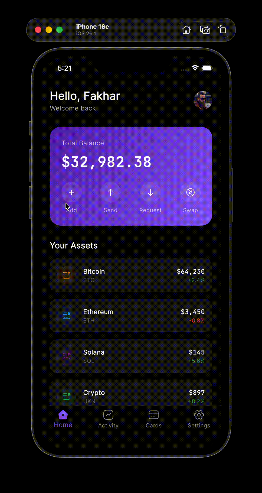

# VORTEX Terminal ⚡


> **Institutional-Grade Trading in Your Pocket.**

Vortex Terminal is a next-generation cryptocurrency dashboard designed for precision and clarity. This project is a **high-fidelity UI prototype** built in a single-file architecture to demonstrate rapid Flutter development and complex widget composition.

---

## 📸 Screenshots

| **Dashboard** | **Activity** |
|:---:|:---:|
|  |  
---

## 🚀 Key Features

* **Cyber-Dark Aesthetics:** A deeply optimized dark theme (`#050505`) with neon purple accents (`#8B5CF6`) for reduced eye strain.
* **Multi-Tab Navigation:** Custom `BottomNavigationBar` logic handling Dashboard, Activity, Cards, and Settings views.
* **Gradient Data Visualization:** Custom-built card widgets using linear gradients and glassmorphism effects.
* **Responsive Layout:** Adaptive UI that looks perfect on devices ranging from iPhone SE to iPhone 15 Pro Max.

---

## 🛠 Tech Stack

* **Framework:** Flutter (v3.x)
* **Language:** Dart
* **Typography:** Google Fonts (`Inter` & `JetBrains Mono`)
* **Icons:** Iconsax
* **Structure:** Monolithic (Single-File Prototype)

---

## ⚡ Getting Started

This project is self-contained. You can run the entire application from the `main.dart` file.

1.  **Clone the repository**
    ```bash
    git clone [https://github.com/fakharearjumand/vortex-terminal-flutter.git](https://github.com/fakharearjumand/vortex-terminal-flutter.git)
    ```

2.  **Install dependencies**
    ```bash
    flutter pub get
    ```

3.  **Run the app**
    ```bash
    flutter run lib/main.dart
    ```

---

## 👤 Author

**Fakhar e Arjumand**
* **Portfolio:** https://fakharearjumand.github.io/FakhareArjumand/
* **LinkedIn:** https://www.linkedin.com/in/fakhar-e-arjumand-b9a1bb319/

---

*This project is for educational and portfolio purposes.*